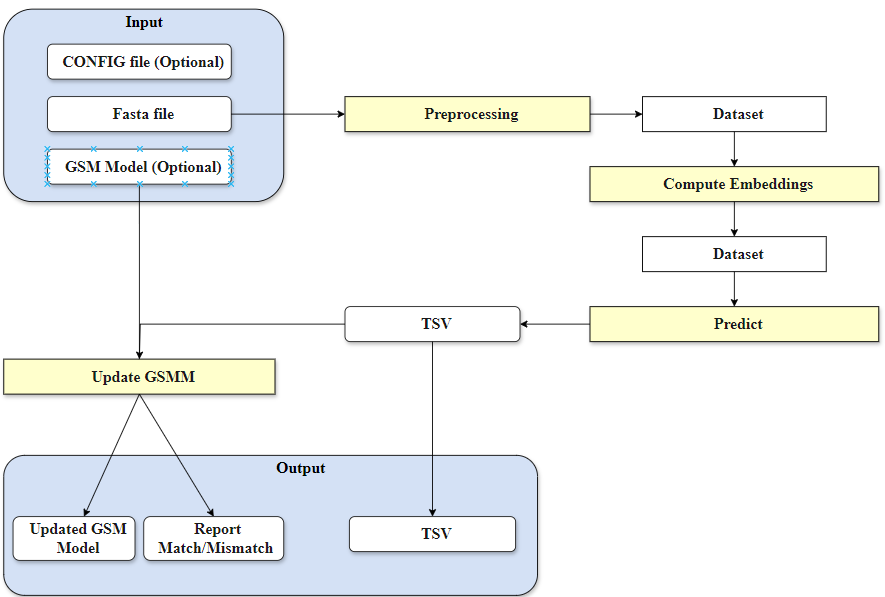

# Cofactor Prediction

## Description

The Cofactor Prediction Tool is a Python-based framework that predicts which cofactors bind to enzymes using machine learning (ML) and deep learning (DL) models. 

This tool processes protein sequence data to predict multiple cofactors for each enzyme, providing critical insights into enzyme functions and metabolic pathways. 
It supports multi-label classification, meaning it can predict multiple cofactors for a single protein sequence.

The tool is specifically designed to correct and enhance Genome-Scale Metabolic Models (GSM) by predicting enzyme-cofactor interactions and updating the models accordingly.
The tool leverages advanced protein embeddings, such as ESM2, SeqVec, and FlashProt, to generate highly detailed representations of protein sequences. 
These embeddings are then utilized by both ML and DL models to make accurate cofactor predictions.


## Features

- Multi-label Classification: Predicts multiple cofactors for each enzyme.
- Machine Learning Models: Includes Random Forest, Extra Trees, XGBoost, and more, using the skmultilearn library for multi-label classification.
- Deep Learning Models: Implements a Convolutional Neural Network (CNN) for high-dimensional sequence data.
- Protein Embeddings: Uses advanced protein embeddings, including ESM2, SeqVec, and FlashProt.
- Web Service: A user-friendly web interface built with Flask for uploading protein sequences and retrieving predictions.
- Optional GSM Model Updates: The tool can update Genome-Scale Metabolic Models (GSM) based on predicted cofactors.
- Docker Deployment: The tool can be deployed using Docker for easier scalability and reproducibility.


## Data Sources

The tool uses the following data sources:

- [BRENDA](https://www.brenda-enzymes.org/): A comprehensive enzyme information system that provides enzyme functional data.
- [UniProt](https://www.uniprot.org/): A comprehensive resource for protein sequence and functional information.
- [Rhea](https://www.rhea-db.org/): A comprehensive resource for enzyme-catalyzed reactions.
- [ChEBI](https://www.ebi.ac.uk/chebi/): A comprehensive resource for chemical entities of biological interest.
- [PDB](https://www.rcsb.org/): A comprehensive resource for protein structures.

These databases provide detailed protein and cofactor data, which are used to train the models.

## Workflow

The diagram below shows the workflow for the Cofactor Prediction Tool.



1. Input: Provide a required FASTA file with protein sequences. Optionally, you can include a CONFIG file and a GSM model.
2. Preprocessing:  The FASTA file is cleaned and prepared for analysis.
3. Embedding Generation: The cleaned data is converted into embeddings (ESM2, SeqVec, or FlashProt) that represent the protein sequences.
4. Prediction: The tool predicts which cofactors bind to the proteins, saving the results in a TSV file.
5. Update GSM Model: If a GSM model was included, it will be updated with the new cofactor predictions and delete the previous results if the user want.
6. Output: The tool provides a TSV file with predictions and, if used, an updated GSM model.


## How to use

### From the Web Service

The tool can be used from *merlin* (version 4.0.15 - to be released soon)  or directly through the hosted web service (currently available only to members of the University of Minho).

**1. Upload the following files:**

* FASTA File (required): Contains the protein sequences. 
* GSM Model (optional): A GSM Model in XML format for updating based on cofactor prediction.
* CONFIG file (optional): A JSON file with custom settings for more specific predictions.
      
#### Configuration File

The tool provides a `config.json` file where you can customize various settings, such as choosing the machine learning model insteadad of the default DL model, changing prediction thresholds, or specifying cofactor mappings. Below is a basic example of a config file:

```json
{
  "model_type": "cnn",  // Change to "xgboost" or "labelpowerset" to use the best two ML models
  "cofactors_map": {
    "NAD": [["nad_c", "nadh_c"], ... ]
    ...
  },
  "drop_non_predicted_reactions": "False", // Change to "True" if you want to drop the non predicted reactions from the model
  "model_path": "/path/to/your/gsm_model.xml"
}
```
   

A FASTA file containing the protein sequences for which you want to predict cofactors
A CONFIG file JSON file with configuration settings for more customized predictions. (Optional)
A GSM model file in XML format for updating based on cofactor predictions. (Optional)

**2. Submit the job:** Once the files are uploaded, submit the job, and the system will process the predictions.

**3. Download Results:** After the job is completed, download the results in a zip folder containing 2 TSV files with the predictions and, if applicable, the updated GSM model.

## Local Setup and Usage

**1. Clone the Repository**
   
```bash
git clone https://github.com/joanag05/CofactorPredictionTool.git
cd CofactorPredictionTool
```


**2. Install Dependencies**

```bash
conda create --name cofactor_prediction python=3.11
conda activate cofactor_prediction
pip install .
```

**3. Run the tool**

```bash
nextflow run main.nf --fasta input.fasta --outdir results/
```
**4. Running the Tool with a Custom Config File**

To use a custom configuration file for specific predictions, include the path to the config file when running the tool:

```bash
nextflow run main.nf --fasta input.fasta --config /path/to/config.json --outdir results/
```
**5 Running the Tool with a GSM Model**

```bash
nextflow run main.nf --fasta input.fasta --model /path/to/gsm_model.xml --outdir results/
```
**6 Running the Tool with a Custom Config File and a GSM Model**
  
```bash
nextflow run main.nf --fasta input.fasta --model/path/to/gsm_model.xml --config /path/to/config.json --outdir results/
```


## Docker Deployment

**1. Build the Docker image:**

```bash
docker build -t cofactor-prediction
```
2. Run the Docker container:

```bash
docker run -v /path/to/path/workdir:/workdir cofactor-prediction
```

## Example Usage 

To predict cofactors for a set of proteins:

1. Upload your FASTA file and your GSM model ((Optional)) for updating with predicted cofactors.
2. Submit the job wait for the results, when you wait you can check the job status.
3. Download the prediction results in a TSV file and the updated GSM model (if applicable).


## License

This project is licensed under the MIT License. See the  file for more information.

## Contact 

For any questions, please contact us:

- Email: joanaoliveira1000@gmail.com


